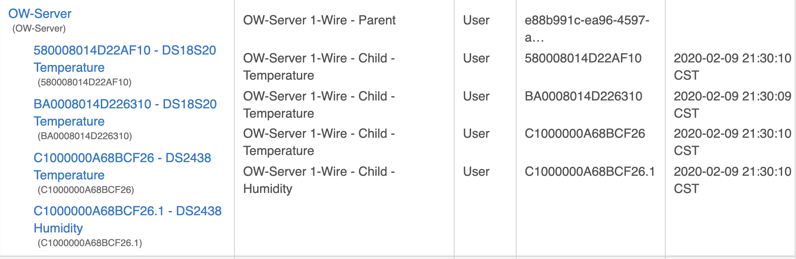
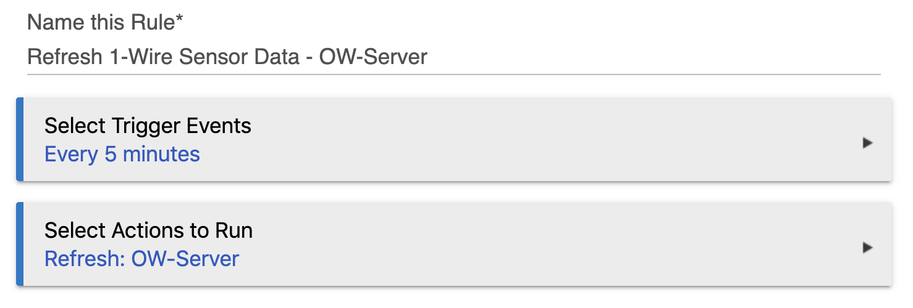

# Hubitat Drivers for OW-Server 1-Wire to Ethernet Server

This set of [Hubitat Elevation](https://hubitat.com/) device drivers enable you to integrate an [EDS OW-Server](https://www.embeddeddatasystems.com/OW-SERVER-1-Wire-to-Ethernet-Server-Revision-2_p_152.html) appliance with Hubitat.  It consists of a parent driver that manages the overall interaction with an OW-Server and set of child drivers to represent different types of 1-Wire sensors supported by the OW-Server.

## About the OW-Server

An OW-Server provides a simple interactive web interface over an ethernet interface to interact with a set of 1-Wire sensors attached to the 1-Wire network ports. In order for sensor data to be made available in Hubitat, we use a set of device drivers to issue GET requests to the OW-Server to obtain sensor data. Typically, you would set up a Hubitat Rule Machine (RM) rule to periodically poll all of your 1-Wire sensors via the OW-Server.

## Current State

Experimental. Basic testing of these drivers has been done. See the associated [issues in GitHub](https://github.com/ckamps/hubitat-drivers-ow-server/issues) for outstanding enhancements of interest.

## Supported 1-Wire Sensors

Although the OW-Server supports a broader set of 1-Wire sensors, these drivers have been tested with and currently support only these sensors:

|Sensor|Type|Notes|
|------|----|-----|
|DS18B20|Temperature||
|DS18S20|Temperature||
|DS2438|Temperature||
|AAG TAI-8540|Temperature / Humidity Sensor|Uses a DS2438 sensor to provide temperature and act as the interface to the 1-Wire network and an HIH-3610-A sensor to provide humidity.|
|OW-ENV-TH|Temperature / Humidity Sensor||

## Usage

### 1. Deploy Drivers to Hubitat

|Driver File|Description|
|-----------|-----------|
|`ow-server-parent.groovy`|Install regardless of the 1-Wire sensors you have in use. Auto discovers 1-Wire sensors via OW-Server and creates child devices.|
|`ow-server-child-temperature.groovy`|Install when you have DS18S20, DS18B20, and/or DS2438 temperature sensors.|
|`ow-server-child-humidity.groovy`|Install when you have the AAG TAI-8540 humidity + temperature sensor or other DS2438-based temperature + humidity sensors.|

### 2. Create Virtual Device for the OW-Server

1. Select the driver "OW-Server 1-Wire - Parent".
1. Set the OW-Server IP address.
1. Press the "Refresh" button on the virtual device to discover the current set of 1-Wire sensors known to the OW-Server and to create child devices for each sensor.
1. Optionally, in each child device change the Device Name and/or Device Label to represent the function and/or location of the associated sensor.

The following example shows the results of the parent driver having performed a discovery of supported 1-Wire sensors, creation of child devices, and the user's modification of most of the child device names to reflect the function of each child.  Several of the child device names have not yet been customized. 

### 3. Configure Auto Refresh of Child Device Readings

Since the OW-Server is not actively sending sensor data to Hubitat, you'll typically want to set up a rule in Rule Machine (RM) to periodically trigger a refresh of the sensors by selecting an every n minutes (or whatever) trigger and an action of "refresh" on the parent device. Doing so will result in the `refreshChildren` command being sent to the parent.

### 4. Perform Ongoing Maintenance of Your Devices

You can manage child devices without impacting the parent and other child devices by:
* Changing the name and/or label of a child device.
* Enabling/disabling logging on a child device.
* Refreshing a child device to get the latest sensor readings.
* Deleting a child device if you either remove the associated sensor or want to have the parent recreate the child device. In the latter case, you can execute the `createChildren` command on the parent to recreate child devices for all sensors for which a child device does not already exist.

## References

### Parent Driver Commands

Within a virtual device associated with the parent driver, you can execute the following commands:

|Command|Description|
|-------|-----------|
|`createChildren`|Discover all sensors known to the OW-Server and create child devices as appropriate.  Loads current sensor reading into each child device.|
|`deleteChildren`|Delete all children.|
|`deleteUnmatchedChildren`|Not yet implemented, but its intent will be to delete child devices that are not known to the OW-Server.|
|`recreateChildren`|Deletes all children and create new children based on newly discovered sensors.|
|`refresh`|See `refreshChildren`.|
|`refreshChildren`|Updates the sensor reading for each child device by calling the `refresh()` method of each child.|

### OW-Server Product Documentation

[OW-Server Documentation](https://www.embeddeddatasystems.com/OW-SERVER-1-Wire-to-Ethernet-Server-Revision-2_p_152.html#tab-6)